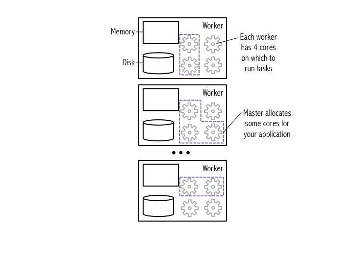

# Understanding Spark and `SparkContext( )`

## OBJECTIVES

* Describe Spark's parallalism with master and executor nodes. 
* Understand `SparkContext()` for managing connections in parallel applications. 
* Provide an overview of major `SparkContext()` properties and methods.  

### Introduction

The PySpark series of lessons and labs will provide you with an introduction to **Apache Spark**, the leading framework for big data processing in jupyter notebooks and PySpark, using a PySpark docker image in a standalone mode. 

Spark comes bundled with a **Cluster Resource Manager** which can divide and share the physical resources of a cluster of machines between multiple Spark applications. Spark's **Standalone cluster manager** operates in the standalone mode and allows Spark to manage its own cluster. 

In Spark computational model, communication routinely occurs between a **driver** and **executors**. The driver has Spark jobs that it needs to run and these jobs are split into tasks that are submitted to the executors for completion. The results from these tasks are delivered back to the driver. The spark driver declares the transformations and actions on data and submits such requests to the **master**. The machine on which the Spark Standalone cluster manager runs is called the **Master Node**. For these labs, this distributed arrangement will be simulated on a single machine allowing you to initialize multiple worker nodes. 

### `SparkContext( )`
In order to use Spark and its API we will need to use a **SparkContext**. A SparkContext is a client of Spark’s execution environment and it acts as the master of the Spark application. SparkContext sets up internal services and establishes a connection to a Spark execution environment. In practical terms, the driver is the program that creates the SparkContext, connecting to a given Spark Master. 

When running Spark, we can start a new Spark application by creating a new SparkContext. After creation, it asks the master for some cores to use to do work. The master sets these cores aside and they don't get used for other applications. This setup is described in the figure below



Spark applications driver program launches various parallel operations on executor Java Virtual Machines (JVMs) running either in a cluster or locally on the same machine. When running locally, "PySparkShell" is the driver program. In all cases, this driver program contains the main loop for the program and creates distributed datasets on the cluster, then applies operations (transformations & actions) to those datasets. Driver programs access Spark through the `SparkContext` object, which represents a connection to a computing cluster. A SparkContext object (usually shown as `sc`) is the main entry point for Spark functionality. A Spark context can be used to create Resilient Distributed Datasets (RDDs) on a cluster.


Lets start a spark application by importing pyspark, creating a spark context as `sc` and try printing out type of `sc`.


```python
import pyspark
sc = pyspark.SparkContext('local[*]')
```


```python
# Display the type of the Spark Context


# pyspark.context.SparkContext
```

### SparkContext attributes

You can use Python's `dir()` function to get a list of all the attributes (including methods) accessible through the sc object.


```python
# Use Python's dir(obj) to get a list of all attributes of SparkContext

```

Alternatively, you can use Python's `help()` function to get an easier to read list of all the attributes, including examples, that the sc object has.


```python
# Use Python's help ( help(object) ) function to get information on attributes and methods for sc object. 

```

You should also have a look at [Spark's SparkContext Documentation Page](https://spark.apache.org/docs/0.6.0/api/core/spark/SparkContext.html) to explore these in further detail.

Let's try to check a few spark context attributes including `SparkContext.version` and `SparkContext.default paralellism` to check the current version of Apache Spark and number of cores being used for parallel processing. 


```python
# Check the number of cores being used


# Check for the current version of Spark


# Default number of cores being used: 2
# Current version of Spark: 2.3.1
```

Let's also check the name of current application by using `SparkContext.appName` attribute. 


```python
# Check the name of application currently running in spark environment


# 'pyspark-shell'
```

A Spark Context can be shut down using `SparkContext.stop()` method. Let's use this method to shut down the current spark context. 


```python
#Shut down SparkContext

```

Once shut down, you can no longer access spark functionality before starting a new SparkContext. 

### Summary:

In this short lab, we saw how SparkContext is used as an entry point to Spark applications. We learnt how to start a SparkContext, how to list and use some of the attributes and methods in SparkContext and how to shut it down. Students are encouraged to explore other attributes and methods offered by the sc object. Some of these, namely creating and transforming datasets as RDDs will be explored in later labs. 
